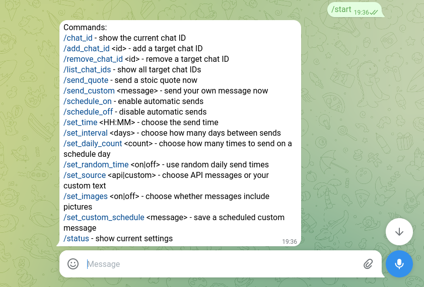
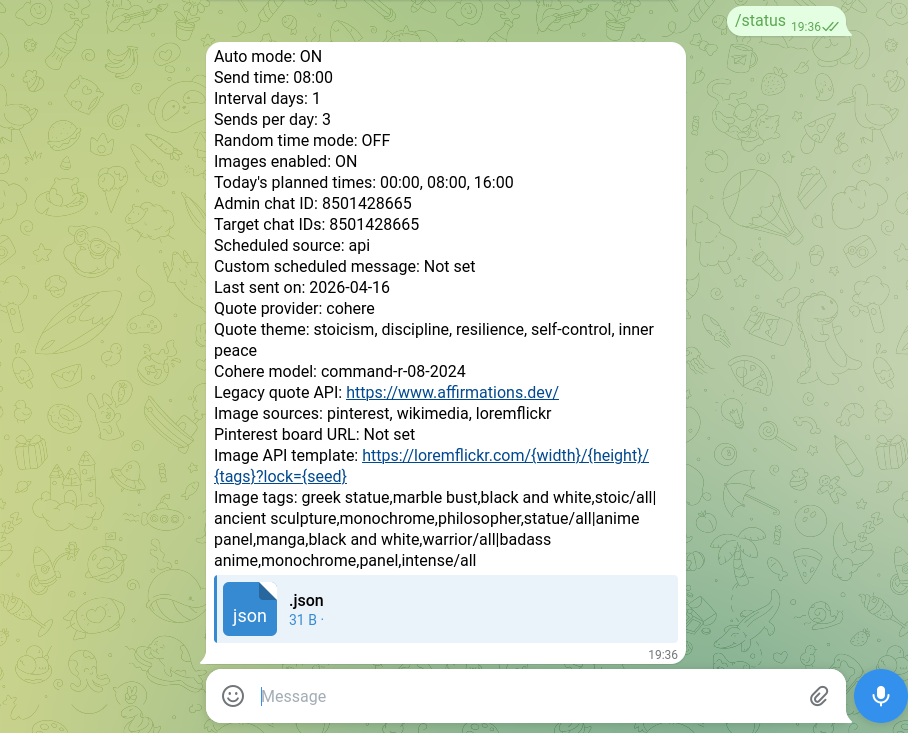
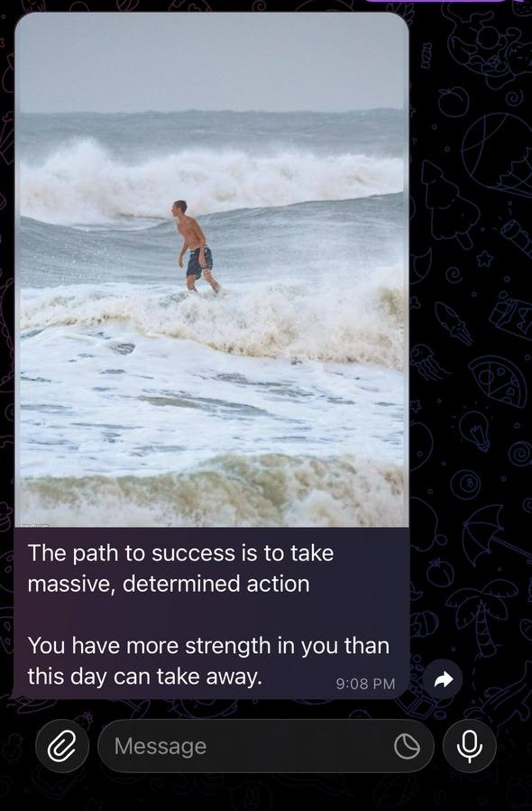
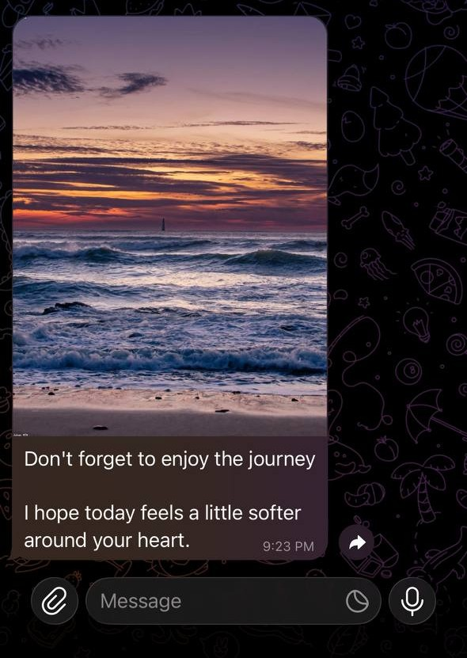

# Telegram Personalized Messaging Bot

A Telegram bot for sending stoic quotes with dark monochrome images, either manually or on a schedule.

## Preview

<p align="center">
  
  
</p>

<p align="center">
  
  
</p>

## Features

- Generate a message with Cohere using `/send_quote`
- Send your own custom message with `/send_custom`
- Attach an image to every message
- Schedule automatic sends
- Choose how many times to send on each schedule day
- Use fixed times or random daily times
- Switch scheduled messages between API mode and custom mode
- Fall back to the legacy API or built-in messages if Cohere is unavailable
- Run easily with Docker Compose

## How The Bot Works

There are 2 important Telegram chats in this project:

- `ADMIN_CHAT_ID`: your own Telegram chat ID. This chat controls the bot.
- `TELEGRAM_CHAT_ID`: the target chat ID. This is where the bot sends messages.

If you want to send the same message to more than one target chat, use `TELEGRAM_CHAT_IDS` with a comma-separated list of chat IDs.

In most cases:

- you send commands from the admin chat
- your target receives the messages in the target chat

Important:

- If the target is a private Telegram user, that user must open your bot and press `Start` at least once before your bot can send messages to them.
- Getting the target ID is not enough by itself. Telegram still requires the target user to start the bot first.

## How To Get Telegram Chat IDs

One easy way is with `@tg_raw_data_bot`.

### Get your admin chat ID

1. Open Telegram and search for `@tg_raw_data_bot`
2. Press `Start`
3. Send any message
4. Copy the value inside `chat.id`
5. Put that value in `ADMIN_CHAT_ID`

### Get the target private user ID

1. Ask the target user to open `@tg_raw_data_bot`
2. They press `Start`
3. They send any message
4. They copy their `chat.id`
5. Put that value in `TELEGRAM_CHAT_ID`
6. Then the target user must also open your bot and press `Start`

### Get a group chat ID

1. Add `@tg_raw_data_bot` to the group
2. Send any message in the group
3. Copy the group's `chat.id`
4. Group IDs are usually negative, often starting with `-100...`
5. Put that value in `TELEGRAM_CHAT_ID`

## Configuration

Copy `.env.example` to `.env` and fill in your values.

### Create The Bot And Get The Token

1. Open Telegram and search for `@BotFather`.
2. Send `/newbot`.
3. Choose a display name for the bot.
4. Choose a username that ends with `bot`.
5. BotFather will give you a token.
6. Put that token into `TELEGRAM_BOT_TOKEN` in `.env`.

Important variables:

- `TELEGRAM_BOT_TOKEN`: your bot token from BotFather
- `ADMIN_CHAT_ID`: your own Telegram chat ID for controlling the bot
- `TELEGRAM_CHAT_ID`: one target chat ID that receives the messages
- `TELEGRAM_CHAT_IDS`: optional comma-separated target chat IDs for broadcasting the same message to multiple chats
- `AUTO_MODE`: start with scheduling on or off
- `INTERVAL_DAYS`: send every N days
- `SENDS_PER_DAY`: how many times to send on each schedule day
- `RANDOM_TIME_MODE`: `true` for random daily times, `false` for fixed times
- `SEND_TIME`: base fixed time like `20:00`
- `APP_TIMEZONE`: app timezone, for example `Africa/Cairo`
- `QUOTE_PROVIDER`: quote source mode, usually `cohere`
- `QUOTE_THEME`: the core quote theme, defaulting to stoicism and discipline
- `COHERE_API_KEY`: your Cohere API key
- `COHERE_MODEL`: Cohere model name, default `command-r-08-2024`
- `COHERE_API_URL`: Cohere chat endpoint
- `QUOTE_API_URL`: optional legacy quote API fallback
- `MESSAGE_TONE_TAGS`: comma-separated tone tags like `stoic,disciplined,calm,intense`
- `IMAGE_API_URL_TEMPLATE`: image URL template
- `IMAGE_TAGS`: image tag groups separated by `|`
- `IMAGE_WIDTH` and `IMAGE_HEIGHT`: image size

You can control the vibe of the generated content from `.env`:

- quote theme: change `QUOTE_THEME`
- message vibe: change `MESSAGE_TONE_TAGS`
- image vibe: change `IMAGE_TAGS`

## Start With Docker

This project is ready to run with Docker Compose.

### 1. Build and start in the background

```bash
docker compose up -d --build
```

### 2. Check logs

```bash
docker compose logs -f
```

### 3. Stop the bot

```bash
docker compose down
```

### 4. Restart after config changes

If you change `.env`, restart the container:

```bash
docker compose up -d --build
```

## Manual Sending

You can send messages immediately from the admin chat.

- `/send_quote`: generate one stoic message and send it to all configured target chats
- `/send_custom Your message here`: send your own custom text to all configured target chats

## Automatic Sending

The scheduler can send automatically to all configured target chats.

Main scheduling commands:

- `/schedule_on`: enable automatic sending
- `/schedule_off`: disable automatic sending
- `/set_time 20:00`: set the fixed base time
- `/set_interval 2`: send every 2 days
- `/set_daily_count 3`: send 3 times on each schedule day
- `/set_random_time on`: use random times during the day
- `/set_random_time off`: use fixed schedule times
- `/set_source api`: scheduled messages come from the API
- `/set_source custom`: scheduled messages use your saved custom text
- `/set_custom_schedule Your scheduled message here`: save the custom scheduled text
- `/status`: show current schedule settings

Random mode currently picks random times between `09:00` and `21:00` for that day.

## Fallback Messages

If Cohere fails, the bot tries the legacy quote API, and after that it falls back to built-in local messages so sending can continue.

You can change those fallback messages in:

- [`bot_app/quotes.py`](bot_app/quotes.py)

Look for the `FALLBACK_QUOTES` list and edit it to match the style you want.

## Legacy API Support

When `QUOTE_PROVIDER=api` or Cohere is unavailable, the bot can still read message text from legacy APIs that return JSON fields such as:

- `affirmation`
- `reason`
- `message`
- `text`
- `quote`
- `body`

If the API also returns `author`, the bot includes it in the message caption/text.

## Main Commands Summary

- `/chat_id`
- `/send_quote`
- `/send_custom Your custom message here`
- `/schedule_on`
- `/schedule_off`
- `/set_time 20:00`
- `/set_interval 2`
- `/set_daily_count 3`
- `/set_random_time on`
- `/set_source api`
- `/set_source custom`
- `/set_custom_schedule Your scheduled message here`
- `/status`

## Notes

- The bot only accepts control commands from `ADMIN_CHAT_ID`
- The target user must start the bot first if you are sending to a private account
- `data/runtime_state.json` stores scheduler state locally
- `.env` is intentionally ignored by Git
